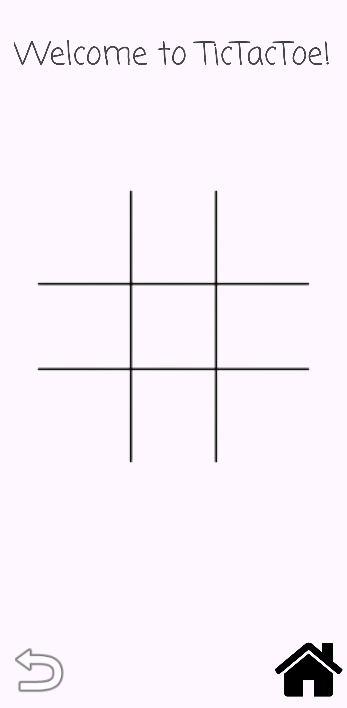
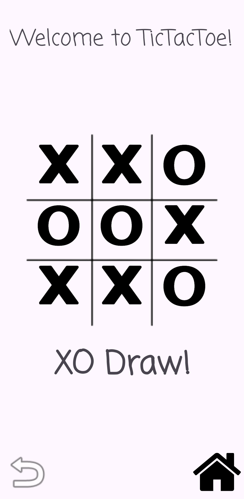

# TicTacToe2Player

A classic two-player Tic Tac Toe game reimagined as an Android application.

---

## Features
- Human vs Human gameplay
- X starts the game
- Win/draw detection
- Redo and Home buttons
- Fade-in animation for X and O symbols

---

## Included
- Source code: `app/src/main/java`
- Resources: `app/src/main/res`
- Gradle wrapper and build files (project is buildable)
- XML layouts and drawable assets

---

## Screenshots

**Starting Position**  


**Mid-Game**  


**Winning Position**  


**Draw Position**  


---

## Setup / Installation

1. Clone this repository:  
   ```bash
   git clone https://github.com/AnbnKr007/TicTacToe2Player.git

## License
See [LICENSE](LICENSE) file for details
